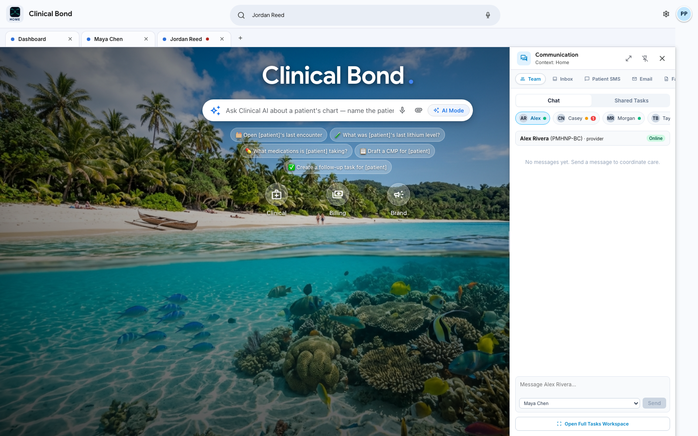
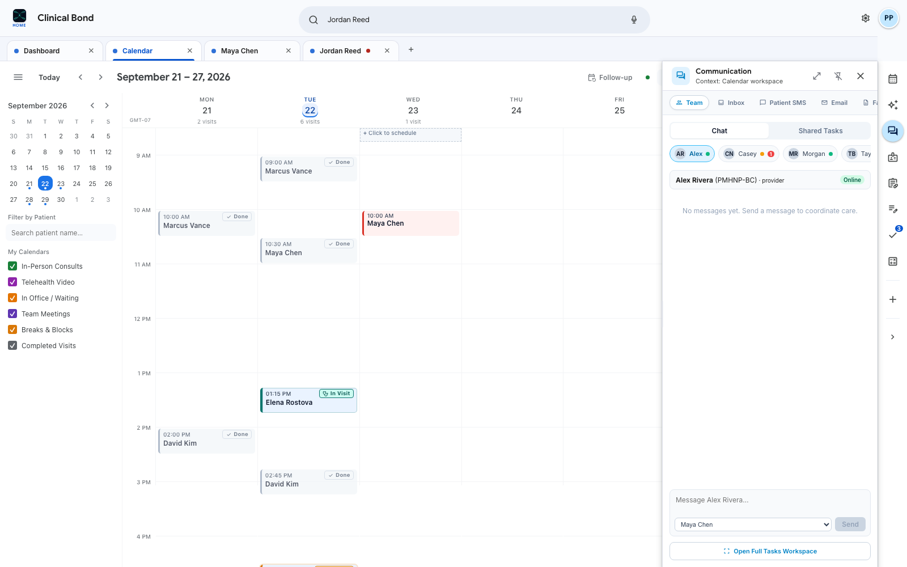
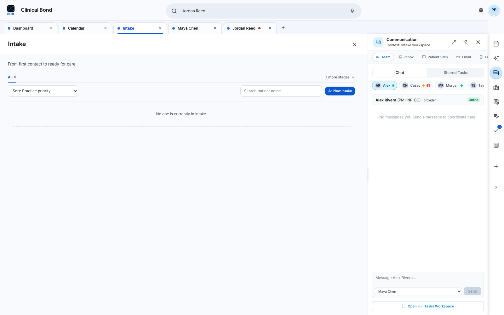
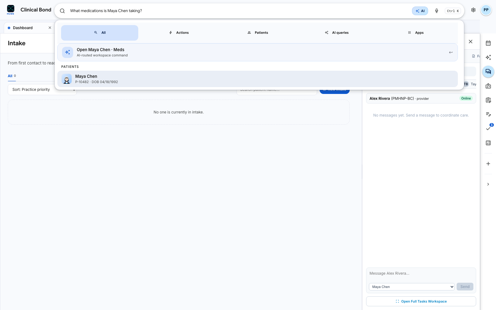
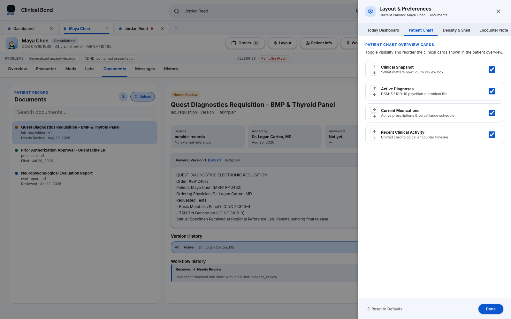

# Clinical Bond — Project Dossier & Visual Guide for Gemini

> **Status**: External briefing snapshot, not a source of truth. Current behavior is governed by [`AGENTS.md`](../../AGENTS.md), [`docs/PRODUCT_VISION.md`](../PRODUCT_VISION.md), [`docs/ARCHITECTURE.md`](../ARCHITECTURE.md), and [`docs/ROADMAP.md`](../ROADMAP.md). The screenshots use synthetic prototype data and capture the application at a point in time.

> **Purpose**: This dossier provides an external Gemini chat session (or any advanced AI system) with a comprehensive, deep-context understanding of **Clinical Bond** — including its philosophy, system architecture, clinical safety constitution, visual design language, code organization, and full UI screenshot tour.
>
> 💡 **Tip for the User**: You can upload or paste this file directly into Gemini Chat, along with the screenshot images located in `docs/gemini-context/screenshots/`.

---

## Quick Prompt to Copy-Paste into Gemini Chat

```text
Hi Gemini,

I am developing Clinical Bond, an electronic health record (EHR) built from the ground up with AI integrated throughout the workspace rather than bolted on as a chatbot.

I have attached:
1. The comprehensive Project Dossier (GEMINI_PROJECT_DOSSIER.md) detailing the architecture, clinical safety rules, workflow models, and codebase structure.
2. A full suite of high-resolution UI screenshots showing the real running application across its primary clinical and administrative surfaces.

Please review this documentation and the UI screenshots. Once you have digested the context, please confirm your understanding of the system philosophy (especially our "Zen to Cockpit" progressive disclosure, browser-like multi-chart workspaces, and strict clinical safety boundaries) and let me know how you can best assist with architectural critique, clinical workflow design, and code implementation.
```

---

## 1. Executive Summary & Core Philosophy

### Mission
Traditional EHR systems (Epic, Cerner, AthenaHealth) are fragmented database forms with rigid, click-heavy interfaces. When AI is added, it is almost always an afterthought: a sidebar chatbot disconnected from clinical workflow.

**Clinical Bond** reimagines the EHR from first principles:
- **Lightweight, browser-like workspace**: Feels like Google Workspace or modern web browsers with persistent, labeled tabs. Clinicians keep multiple patient charts open simultaneously, moving between them with zero latency and zero lost state.
- **Ambient AI Substrate**: AI is not a chatbot in a drawer. It is an ambient substrate and a workspace operator that can interpret natural language or voice intent, summon records, draft structured documentation, filter schedules, reconfigure layout cards, and identify inconsistencies.
- **Core Product Formula**:
  $$\text{Clinician Intent (Voice/Text/Direct)} \longleftrightarrow \text{Dynamic Workspace (Zen to Cockpit)} \longleftrightarrow \text{Structured Clinical State} \longleftrightarrow \text{Ambient AI Substrate}$$

---

## 2. Fundamental Architectural & Constitutional Rules

The project constitution is codified in [`AGENTS.md`](../../AGENTS.md) and [`docs/PRODUCT_VISION.md`](../PRODUCT_VISION.md). Any agent or AI assisting this project MUST uphold these non-negotiable principles:

1. **Patient = Workspace, Not Page**:
   A patient chart is an active workspace that persists as a Chrome-like tab across the top. Clinicians do not close one patient to view another.
2. **Elastic Complexity & Progressive Disclosure ("Zen to Cockpit")**:
   The workspace dynamically scales between:
   - **Zen Pad**: A distraction-free, minimalist layout tailored for psychotherapy, psychotherapy follow-ups, or deep clinical focus.
   - **Cockpit**: A high-density, multi-metric interface for psychopharmacology, acute triage, high-volume schedules, lab surveillance, and medication reconciliation.
   - The system *never* forces a one-size-fits-all density.
3. **AI as Workspace Operator & Canvas Controller**:
   The clinician can speak or type: *"Open Maya Chen's meds"* or *"Draft a CMP for Elena"*, and the omnibox planner routes directly to the chart, stages orders, or highlights relevant findings.
4. **Authoritative Clinical Safety Boundaries**:
   - **Never Fabricate**: AI must never invent clinical facts, history, diagnoses, medications, labs, or orders.
   - **Strict Provenance**: Every AI suggestion, auto-coding recommendation, or summary must link to source clinical data (with cryptographic SHA-256 hash validation for documents).
   - **Explicit Human Confirmation**: No AI output ever enters the legal medical record, signs an encounter note, submits a billing claim, or transmits a prescription without explicit authorized clinician action.
5. **Vendor Isolation via Adapters**:
   External vendors (planned e-prescribing and EPCS providers, lab vendors, payment processors, and clearinghouses) are isolated behind clear domain adapters (`app/adapters/`). The core EHR domain model never mirrors external vendor schemas.
6. **Vanilla CSS Design System**:
   We use semantic vanilla CSS and custom design tokens (strictly **no Tailwind CSS**). The aesthetic is light, calming, responsive, and legible, inspired by Google Workspace with warm medical accents.

---

## 3. Technology Stack & Directory Map

### Tech Stack
- **Framework**: Next.js 16.3 (App Router with TurboPack)
- **UI Engine**: React 19 (Server and Client components)
- **Language**: TypeScript 5.9 (Strict mode)
- **Styling**: Pure Vanilla CSS (`globals.css`, scoped CSS modules, CSS custom properties)
- **Data Persistence**: SQLite (Node.js native SQLite driver) with schema migrations in `app/server/db/`
- **Testing**: Node test runner (`tsx --test`) for unit/domain logic; Playwright 1.62 for full browser end-to-end testing

### Repository Layout

```
├── AGENTS.md                  # Project constitution, safety rules, and coding contracts
├── docs/                      # Authoritative architecture and product documentation
│   ├── PRODUCT_VISION.md      # Canonical user experience and requirement specifications
│   ├── ARCHITECTURE.md        # System boundaries, data flow, and authority
│   ├── AI_SYSTEM.md           # AI context assembly, provenance, and intent planning
│   ├── UI_SYSTEM.md           # Shared UI interaction grammar and design tokens
│   ├── ROADMAP.md             # Active work queue, verified milestones, and status
│   └── gemini-context/        # Gemini briefing materials & screenshots
│       ├── GEMINI_PROJECT_DOSSIER.md
│       └── screenshots/       # 12 high-resolution UI captures
├── app/
│   ├── page.tsx               # Primary workspace mount point
│   ├── layout.tsx             # Root layout with font and metadata tokens
│   ├── components/
│   │   ├── auth/              # Auth gate, session management, synthetic personas
│   │   ├── dashboard/         # Today dashboard, widget registry, adaptive layouts
│   │   ├── encounter/         # Encounter note editor, live coding, reference pills
│   │   ├── workspace/         # Chrome-like tabs, TopBar, Omnibox, Patient header
│   │   ├── companion/         # Right companion dock (Team chat, Tasks, Calculators)
│   │   ├── orders/            # Staged medication cart, lab orders modal
│   │   ├── home/              # Zen Home launcher with scenic aesthetic
│   │   ├── workspaces/        # Calendar, Intake, Documents, Billing workspaces
│   │   └── WorkspaceCustomizer.tsx # Layout customizer & density switcher drawer
│   ├── domain/                # Pure TypeScript business logic (patient, encounter, etc.)
│   ├── lib/                   # React hooks, preference engine, client-side event bus
│   ├── adapters/              # External service adapters (prescriptions, labs, billing)
│   └── server/                # Database schema, queries, API route handlers
└── tests/                     # 120+ unit tests & Playwright browser specs
```

---

## 4. Comprehensive UI Screenshot Tour

All screenshots below were captured from the running application at a high-resolution viewport ($1600 \times 1000$).

---

### Screenshot 1: Authentication & Role-Aware Personas
**File**: `docs/gemini-context/screenshots/01_auth_signin_gate.png`


- **What it demonstrates**:
  - Secure credential and token activation flow.
  - Role-aware prototype personas: **Prototype Provider**, **Taylor (Provider)**, **Alex Rivera (PMHNP)**, **Morgan Reed (Practice Manager & Biller)**, and **Casey (Clinical Assistant)**.
  - Strict session boundary enforcement preventing chart state leakage across clinician accounts.

---

### Screenshot 2: Today Clinical Cockpit Dashboard
**File**: `docs/gemini-context/screenshots/02_today_clinical_cockpit.png`


- **What it demonstrates**:
  - **Two-Level Shell**: Calm global top bar (Search/AI Omnibox, Quick navigation, Profile) above persistent labeled workspace tabs (`Dashboard`, `Maya Chen`, `Jordan Reed`, `+`).
  - **Day at a Glance**: Contextual clinical awareness highlighting the next arrival (`Maya Chen` at 10:00 AM) with immediate actions (*Open next chart*, *Review unsigned draft*).
  - **Schedule Stream**: Real-time visit roster with status filters (*Tentative*, *Confirmed*, *In Office*, *In Visit*, *Completed*) and toggle between Roster, Day Grid, and Calendar Window.
  - **Outstanding Work Queue**: Prioritized clinical inbox separating unsigned encounter notes, lab results needing review, prescription refills, and team handoffs.
  - **Team Collaboration**: Live presence of practice colleagues (Alex Rivera PMHNP, Casey Nguyen, Morgan Reed) and pending handoff tasks.
  - **Right Tool Dock**: Collapsed companion rail on the far right with active badge indicators.

---

### Screenshot 3: Universal Open Workspace Launcher (`+`)
**File**: `docs/gemini-context/screenshots/03_open_workspace_launcher.png`


- **What it demonstrates**:
  - Upgraded browser `+` button opening an instant popover launcher.
  - Keyboard-accessible search (`Find workspace or patient...`).
  - Single-click access to core suite entities: **Home**, **Calendar**, **Patients**, **Intake**, **Documents (with unread badge counts)**, **Labs**, **HR**, and **Billing**.
  - **Singleton Navigation Rule**: Clicking an already open workspace focuses the existing tab rather than spawning duplicate charts.

---

### Screenshot 4: Patient Workspace Overview (Maya Chen)
**File**: `docs/gemini-context/screenshots/04_patient_workspace_overview.png`


- **What it demonstrates**:
  - **Patient Identity Header**: Unambiguous patient identification (Maya Chen, Established, DOB 04/18/1992, 34 yrs, MRN P-10482, Clinical Photo).
  - **Action Toolbar**: Orders Cart, Layout Customizer, Patient Info Drawer, Worklist, Messages, Schedule, Open Encounter.
  - **Clinical Snapshot ("What Needs Attention & What Is Next")**:
    - High-urgency red safety alert: Positive PHQ-9 Item 9 suicide risk endorsement triggering immediate clinical protocol.
    - Surveillance alert: Guanfacine ER protocol requiring resting BP & pulse monitoring.
    - Unsigned encounter draft alert.
  - **Vitals & Metabolic Trends**: 118/76 mmHg, HR 72 bpm, BMI 22.4, GAD-7 score (5/21 Mild Anxiety).
  - **Active Problem List & Pharmacotherapy**: Coded diagnoses (F41.1 Generalized anxiety, F90.2 ADHD) and active regimens (Sertraline 100mg, Guanfacine ER 2mg).

---

### Screenshot 5: Clinical Encounter Note & Live Coding Assistant
**File**: `docs/gemini-context/screenshots/05_encounter_note_editor.png`


- **What it demonstrates**:
  - **Structured Note Authoring**: Specialized outpatient psychiatric evaluation and management note with Chief Complaint, Interval History, ROS, Current Medications, and Allergies.
  - **Clinical Findings Toolbar**: One-tap clinical chips for Mental Status, Symptoms, Treatment Response, and Risk Assessment.
  - **Live Documentation & Coding Bar**: Real-time documentation completeness tracking (2 of 7 items documented) with suggested CPT code (e.g. `99212` / `99214`) backed by note evidence.
  - **Review & Sign Modal**: Explicit human signature gate before finalizing the legal record.

---

### Screenshot 6: Document Reader with SHA-256 Provenance
**File**: `docs/gemini-context/screenshots/06_documents_provenance_sha.png`


- **What it demonstrates**:
  - Integrated document viewer with direct inspection of external clinical records (Quest Diagnostics Requisitions, Prior Authorization Approvals, Neuropsychological Evaluations).
  - **Cryptographic Provenance**: Every document maintains its original SHA-256 hash badge, upload origin, and version history.
  - Document intake capability with manual upload or automated e-fax integration.

---

### Screenshot 7: Right Companion Rail (Communication Dock)
**File**: `docs/gemini-context/screenshots/07_communication_companion.png`


- **What it demonstrates**:
  - **Context-Preserving Multi-Tasking**: The Communication companion docks on the right rail, allowing clinicians to chat with team members (Alex Rivera, Casey, Morgan) or draft patient SMS messages without closing the patient chart.
  - Channels for **Team Chat**, **Inbox**, **Patient SMS**, **Email**, and **e-Fax**.
  - Contextual tagging linking internal conversations directly to the active patient chart (`Context: Maya Chen`).

---

### Screenshot 8: Zen Home Suite Launcher
**File**: `docs/gemini-context/screenshots/08_zen_home_launcher.png`



- **What it demonstrates**:
  - **Calming Ambient Aesthetic**: High-resolution scenic backdrop providing an instant visual reset from clinical cognitive overload.
  - **Ambient AI Intent Bar**: Centered natural language prompt ("Ask Clinical AI about a patient's chart — name the patient") with voice input toggle.
  - **Structured Query Chips**: Non-hallucinatory templates ("Open [patient]'s last encounter", "What was [patient]'s last lithium level?", "Draft a CMP for [patient]").
  - **Suite Navigation**: Primary launch tiles for **Clinical**, **Billing**, and **Brand**.

---

### Screenshot 9: Interactive Calendar Workspace
**File**: `docs/gemini-context/screenshots/09_calendar_workspace.png`



- **What it demonstrates**:
  - Multi-view practice scheduling grid (Day, Week, Month) with time intervals.
  - Color-coded appointment blocks (In-Person Consults, Telehealth Video, In Office / Waiting, Team Meetings, Breaks).
  - Patient search filter and direct visit kickoff from calendar events.

---

### Screenshot 10: Prospective Patient Intake Workspace
**File**: `docs/gemini-context/screenshots/10_intake_workspace.png`



- **What it demonstrates**:
  - Dedicated prospective patient pipeline managing patients from first inquiry to visit-ready.
  - Multi-stage pipeline tracking (Inquiry, Insurance Verification, Clinical Screening, Scheduling).
  - Fast prospect creation with optional immediate appointment booking.

---

### Screenshot 11: AI Omnibox Natural Language Operator
**File**: `docs/gemini-context/screenshots/11_omnibox_ai_intent.png`



- **What it demonstrates**:
  - Omnibox (`Ctrl K` or Voice) serving as the workspace operator.
  - Natural language parsing ("What medications is Maya Chen taking?").
  - Categorized result routing: **All**, **Actions** (e.g. *Open Maya Chen · Meds*), **Patients**, **AI queries**, and **Apps**.
  - Directly opens the correct patient chart and tab with zero menu navigation.

---

### Screenshot 12: Adaptive Layout Customizer (Elastic Density)
**File**: `docs/gemini-context/screenshots/12_adaptive_layout_customizer.png`



- **What it demonstrates**:
  - **Progressive Disclosure Drawer**: Empowers each clinician to customize their workspace.
  - Tabs: **Today Dashboard**, **Patient Chart**, **Density & Shell**, **Encounter Note**.
  - Modular Window Arrangement: Toggle or reorder AI Morning Briefing, Patient Flow Roster, Daily Metric Cards, Action Queues, Team Collaboration, and Waiting Room.
  - Information Density Switcher: Seamless toggling between **Comfortable**, **Compact**, and **Minimal** modes.

---

## 5. How Gemini Chat Can Help & Key Discussion Topics

When discussing Clinical Bond in Gemini Chat, here are prime areas where Gemini can provide high-value analysis, design feedback, and code suggestions:

1. **Clinical Workflow & Safety Review**:
   - Critiquing the psychiatric assessment flows, suicide risk protocols (PHQ-9 Item 9 escalation), and medication monitoring rules (e.g., lithium levels, metabolic monitoring for atypical antipsychotics).
   - Designing safety guardrails for e-prescribing controlled substances (EPCS) and 2FA credential ceremonies.
2. **Cognitive Ergonomics & Progressive Disclosure**:
   - Evaluating the density transitions between the Zen Pad and Cockpit modes.
   - Recommending keyboard shortcuts, micro-interactions, and visual hierarchy enhancements to minimize clinician clicks and cognitive burden.
3. **AI Ambient Intent Planning**:
   - Expanding the Omnibox natural language grammar for complex clinical queries (e.g. longitudinal lab comparison, cross-encounter symptom tracking).
   - Designing zero-shot clinical summarization prompts that enforce strict provenance citations.
4. **Architecture & Interoperability**:
   - Designing standard FHIR R4 mapping boundaries for integration adapters (`Patient`, `Encounter`, `Condition`, `MedicationRequest`, `Observation`).
   - Advising on SQLite/PostgreSQL schema optimizations for longitudinal time-series data.

---

*Generated for Clinical Bond pair-programming & Gemini Chat analysis.*
