# Clinical Bond — Complete Project Dossier & Visual Guide for Gemini

> **Purpose**: This dossier provides an external Gemini chat session (or any advanced AI system) with an authoritative, deep-context understanding of **Clinical Bond** — including its philosophy, system architecture, clinical safety constitution, visual design language, code organization, full UI screenshot tour, and all major architectural enhancements completed to date.
>
> 💡 **Tip for the User**: You can upload or paste this file directly into Gemini Chat, along with the screenshot images located in `docs/gemini-context/screenshots/`.

---

## Quick Prompt to Copy-Paste into Gemini Chat

```text
Hi Gemini,

I am developing Clinical Bond, an electronic health record (EHR) built from the ground up with AI integrated throughout the workspace rather than bolted on as a chatbot.

I have attached:
1. The comprehensive Project Dossier (GEMINI_PROJECT_DOSSIER.md) detailing the architecture, clinical safety rules, workflow models, and codebase structure.
2. A full suite of high-resolution UI screenshots (18 captures) showing the real running application across its primary clinical, encounter, monitoring, and billing surfaces.

Please review this documentation and the UI screenshots. Once you have digested the context, please confirm your understanding of the system philosophy (especially our "Zen to Cockpit" progressive disclosure, browser-like multi-chart workspaces, ambient AI substrate, strict clinical safety boundaries, and visit readiness engine) and let me know how you can best assist with architectural critique, clinical workflow design, and code implementation.
```

---

## 1. Executive Summary & Core Philosophy

### Mission
Traditional EHR systems (Epic, Cerner, AthenaHealth) are fragmented database forms with rigid, click-heavy interfaces. When AI is added, it is almost always an afterthought: a sidebar chatbot disconnected from clinical workflow.

**Clinical Bond** reimagines the EHR from first principles:
- **Lightweight, browser-like workspace**: Feels like Google Workspace or modern web browsers with persistent, labeled tabs. Clinicians keep multiple patient charts open simultaneously, moving between them with zero latency and zero lost state.
- **Ambient AI Substrate**: AI is not a chatbot in a drawer. It is an ambient substrate and a workspace operator that can interpret natural language or voice intent, summon records, draft structured documentation, project visit readiness gaps, filter schedules, reconfigure layout cards, and identify clinical inconsistencies.
- **Core Product Formula**:
  $$\text{Clinician Intent (Voice/Text/Direct)} \longleftrightarrow \text{Dynamic Workspace (Zen to Cockpit)} \longleftrightarrow \text{Structured Clinical State} \longleftrightarrow \text{Ambient AI Substrate}$$

---

## 2. Fundamental Architectural & Constitutional Rules

The project constitution is codified in [`AGENTS.md`](file:///Users/logancarton/Desktop/EHR/AGENTS.md) and [`docs/PRODUCT_VISION.md`](file:///Users/logancarton/Desktop/EHR/docs/PRODUCT_VISION.md). Any agent or AI assisting this project MUST uphold these non-negotiable principles:

1. **Patient = Workspace, Not Page**:
   A patient chart is an active workspace that persists as a Chrome-like tab across the top. Clinicians do not close one patient to view another.
2. **Elastic Complexity & Progressive Disclosure ("Zen to Cockpit")**:
   The workspace dynamically scales between:
   - **Zen Pad**: A distraction-free, minimalist layout tailored for psychotherapy, psychotherapy follow-ups, or deep clinical focus.
   - **Cockpit**: A high-density, multi-metric interface for psychopharmacology, acute triage, high-volume schedules, lab surveillance, and medication reconciliation.
   - The system *never* forces a one-size-fits-all density.
3. **AI as Workspace Operator & Canvas Controller**:
   The clinician can speak or type: *"Open Maya Chen's meds"* or *"Draft a CMP for Elena"*, and the omnibox planner routes directly to the chart, stages orders, or highlights relevant findings.
4. **Authoritative Clinical Safety Boundaries**:
   - **Never Fabricate**: AI must never invent clinical facts, history, diagnoses, medications, labs, or orders.
   - **Strict Provenance**: Every AI suggestion, auto-coding recommendation, or summary must link to source clinical data (with cryptographic SHA-256 hash validation for documents and frozen hashes for signed notes).
   - **Explicit Human Confirmation**: No AI output ever enters the legal medical record, signs an encounter note, submits a billing claim, or transmits a prescription without explicit authorized clinician action.
5. **Vendor Isolation via Adapters**:
   External vendors (SureScripts for e-prescribing, EPCS providers, Quest/Labcorp for lab results, Stripe for payments, clearinghouses for claims) are isolated behind clear domain adapters (`app/adapters/`). The core EHR domain model never mirrors external vendor schemas.
6. **Patient Scope & Inactive Parking Boundary (ERG-1)**:
   Companion tools (Clinical AI, Calculators, Scratchpad, Tasks) strictly bind to the active patient chart. When non-patient workspaces (Billing, Intake, Calendar) are active, chart-bound actions are parked safely with clear visual status banners to prevent cross-patient data leakage.
7. **Calm Two-Level Shell (UI-8)**:
   A calm global top bar (Brand home launcher, Omnibox AI intent search, Settings/Profile) sits directly above the persistent labeled workspace tabs (`Dashboard`, patient tabs, and the `+` Open Workspace launcher). Full-width intermediate navigation rows have been retired to eliminate visual clutter.

---

## 3. Technology Stack & Key Architectural Milestones

### Tech Stack
- **Framework**: Next.js 16.3 (App Router with TurboPack)
- **UI Engine**: React 19 (Server and Client components)
- **Language**: TypeScript 5.9 (Strict mode)
- **Styling**: Pure Vanilla CSS (`globals.css`, scoped CSS modules, CSS custom properties — strictly **no Tailwind CSS**)
- **Data Persistence**: SQLite (Node.js native SQLite driver) with immutable schema migrations in `app/server/db/`
- **Testing**: Node test runner (`tsx --test`) for unit/domain logic; Playwright 1.62 for full browser end-to-end testing (124+ unit tests, 40+ browser specs)

### Key Milestone Implementations
1. **Visit Readiness Engine in Chart & Note (D-100 / NOTE-READY-1)**:
   - **Redesigned Patient Overview**: Reoriented around immediate visit readiness: unresolved safety alerts, pre-visit metrics, active medications, problem list, and recent longitudinal changes.
   - **Encounter Visit Readiness Panel**: A live panel docked beside the note projecting coding goals (CPT 99214 medical decision-making pillars), care-completion loops, clinical monitoring alerts, and billing readiness. Suggestions follow cursor position; Focus mode dims secondary chrome for distraction-free writing.
2. **Practice Billing Setup, Fee Schedules & Superbill Generation (D-101 / BILL-1)**:
   - Charge templates per note template, practice fee schedules (charges pull amounts solely from fee schedules), attested add-on codes (psychotherapy add-on `+90833`, interactive complexity `+90785`) sealed into signed snapshots.
   - Audited **Superbill** generation (`SuperbillDocument.tsx`) for private pay / out-of-network claims, complete with diagnostic coding, NPI, taxonomy, and practice billing address.
3. **Configurable Clinical Monitoring Workflow (D-099)**:
   - Layered monitoring policies (`ClinicalMonitoringSettingsModal.tsx`) for psychiatric medications (second-generation antipsychotic metabolic surveillance, lithium level monitoring, baseline ECG, renal panels).
   - Strict 4-tier hierarchy: *System starter $\rightarrow$ Practice default $\rightarrow$ Provider override $\rightarrow$ Patient exception*. Overdue items generate actionable clinical attention alerts.
4. **Vitals & Laboratory Observation Category Separation (D-103 / STORE-1)**:
   - Strict category boundaries: blood pressure, pulse, weight, and BMI are vital signs (`observation-categories.ts`); labs/imaging/procedures are distinct observations.
   - Added manual **Record Result** and **Record Vitals** entry modals in the Labs section (`LabResultEntryForm.tsx`). Vitals can no longer displace longitudinal lab histories in chart snapshots.
5. **Grouped Outstanding Labs by Lab Order (`commit 41d9c02`)**:
   - Treats one lab order as one unit of clinical work. Individual analytes are grouped under their parent order ID to eliminate alert fatigue.
6. **Patient Lab Ordering Companion (`commit 1540c8f`)**:
   - Right-rail companion panel (`labs`) for staging lab requisitions directly to Quest or LabCorp with protocol surveillance presets.
7. **Full ASRS v1.1 Adult ADHD Assessment Instrument (`commits 45bdb66, 66818ef, ae62802`)**:
   - Standardized 18-question WHO Adult ADHD Self-Report Scale with authentic Part A shaded-box threshold rules (4+ responses in threshold zones constitute a positive ADHD screen) and one-click note insertion.

---

## 4. Comprehensive UI Screenshot Tour (18 High-Resolution Captures)

All screenshots below were captured from the running application at a high-resolution desktop viewport ($1600 \times 1000$).

---

### Screenshot 1: Authentication & Role-Aware Personas
**File**: `docs/gemini-context/screenshots/01_auth_signin_gate.png`

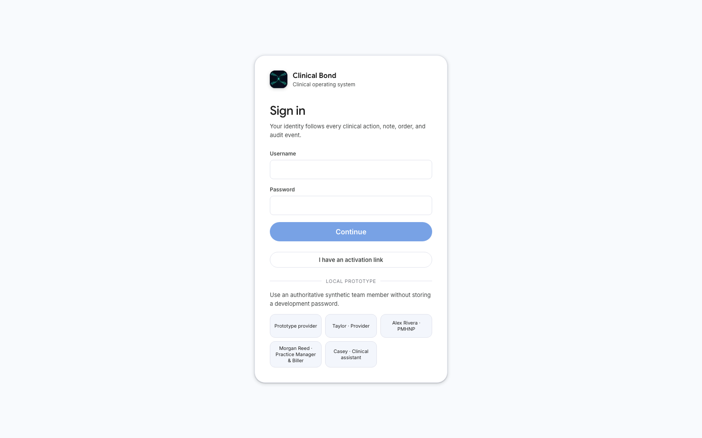

- **What it demonstrates**:
  - Secure credential and token activation flow.
  - Role-aware prototype personas: **Prototype Provider**, **Taylor (Provider)**, **Alex Rivera (PMHNP)**, **Morgan Reed (Practice Manager & Biller)**, and **Casey (Clinical Assistant)**.
  - Strict session boundary enforcement preventing chart state leakage across clinician accounts.

---

### Screenshot 2: Today Clinical Cockpit Dashboard
**File**: `docs/gemini-context/screenshots/02_today_clinical_cockpit.png`

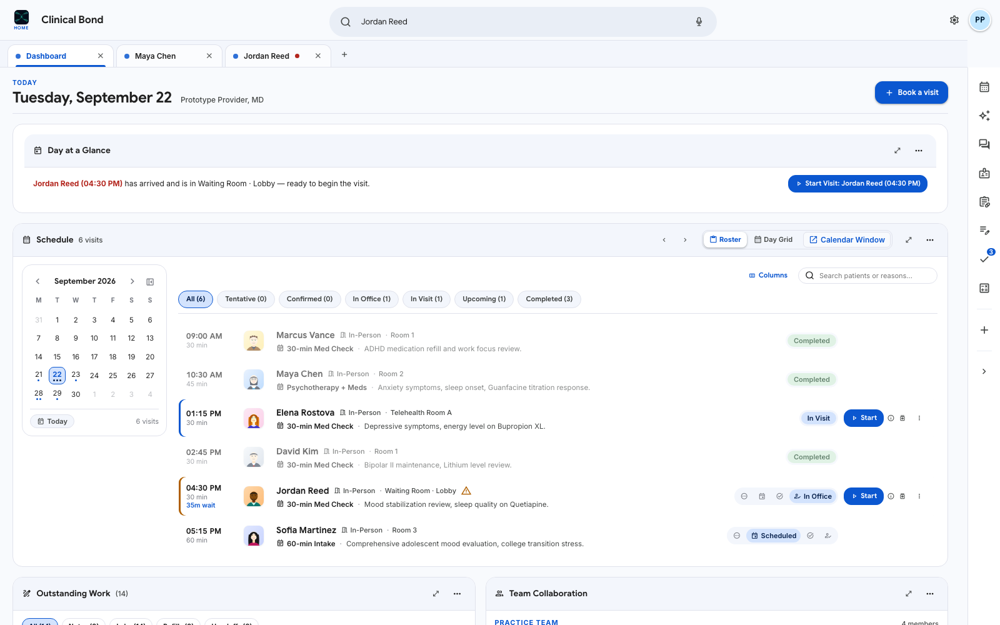

- **What it demonstrates**:
  - **Calm Two-Level Shell**: Global top bar (Brand mark, Omnibox, Profile) above persistent labeled workspace tabs (`Dashboard`, `Maya Chen`, `Jordan Reed`, `+`).
  - **Day at a Glance**: Contextual clinical awareness highlighting waiting room arrivals (*"Jordan Reed (04:30 PM) has arrived and is in Waiting Room · Lobby — ready to begin the visit"* with one-click *Start Visit*).
  - **Full Schedule Stream**: Multi-patient practice schedule with visit types (30-min Med Check, Psychotherapy + Meds, 60-min Intake) and real-time status badges (*Completed*, *In Visit*, *In Office*, *LATE*).
  - **Right Tool Dock**: Collapsed companion rail on the far right with active badge indicators (including the Labs tool with unread results badge).

---

### Screenshot 2b: Outstanding Work — Grouped Lab Orders by Order ID
**File**: `docs/gemini-context/screenshots/02b_today_grouped_lab_orders.png`

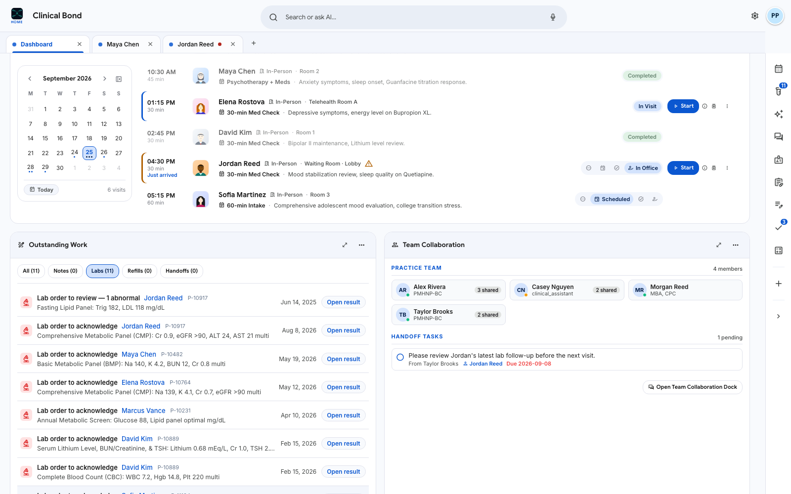

- **What it demonstrates**:
  - **Alert Fatigue Reduction**: Category filter bar showing **Labs (4)** instead of 14 individual analyte rows.
  - The 14 analytes from Quest Diagnostics are grouped under their 4 parent orders. One lab order = one clinical action.

---

### Screenshot 3: Universal Open Workspace Launcher (`+`)
**File**: `docs/gemini-context/screenshots/03_open_workspace_launcher.png`

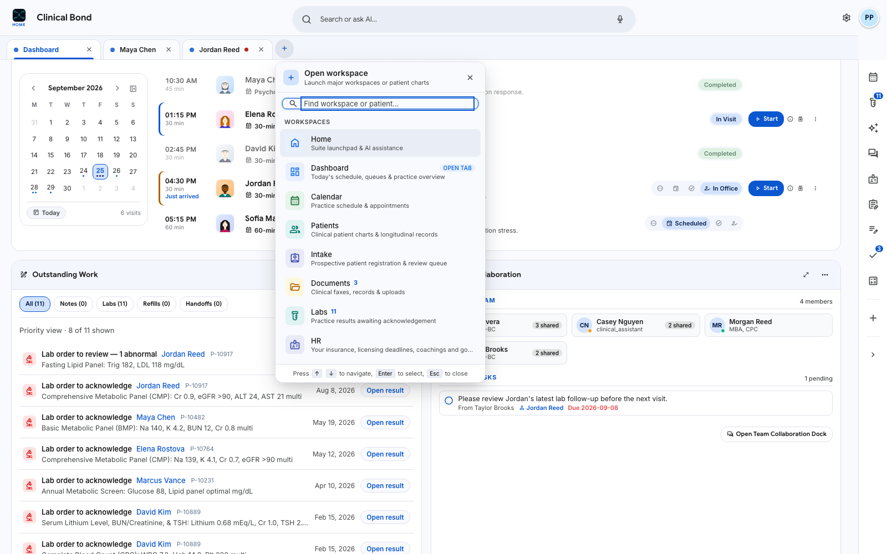

- **What it demonstrates**:
  - Upgraded browser `+` button opening an instant popover launcher.
  - Keyboard-accessible search (`Find workspace or patient...`).
  - Single-click access to core suite entities: **Home**, **Calendar**, **Patients**, **Intake**, **Documents (with unread badge counts)**, **Labs**, **HR**, and **Billing**.
  - **Singleton Navigation Rule**: Clicking an already open workspace focuses the existing tab rather than spawning duplicate charts.

---

### Screenshot 4: Redesigned Patient Workspace Overview (Visit Readiness D-100)
**File**: `docs/gemini-context/screenshots/04_patient_workspace_overview.png`

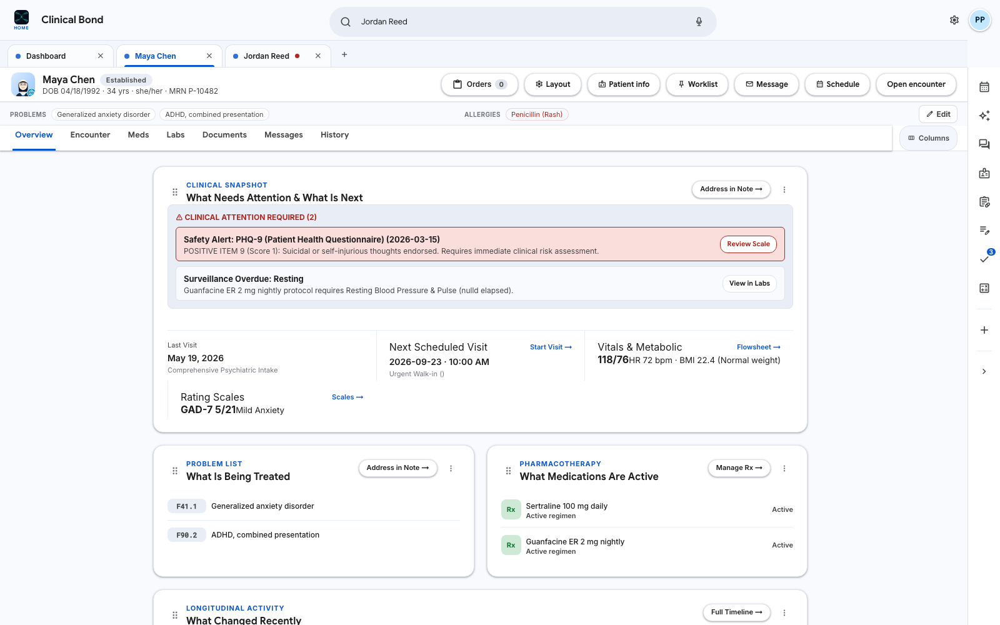

- **What it demonstrates**:
  - **Patient Identity Header**: Unambiguous patient identification (Maya Chen, Established, DOB 04/18/1992, 34 yrs, MRN P-10482, Clinical Photo).
  - **Streamlined Actions**: Orders (0), Patient info, Message, ... More, Open encounter.
  - **Visit Readiness Card ("What Matters for This Visit")**:
    - Unresolved safety alert: Positive PHQ-9 Item 9 suicide risk endorsement triggering immediate clinical protocol.
    - Unsigned draft alert with one-click *Resume Note*.
  - **Pre-Visit Readiness Metrics**:
    - Last Visit (Sep 24, 2026 Psychiatric Follow-Up)
    - Next Visit (Sep 25, 2026 Urgent Walk-in)
    - Active Meds (Sertraline, Guanfacine ER)
    - Vitals (118/76 mmHg, HR 72, BMI 22.4)
    - Rating Scale (ASRS v1.1 Positive Screen)
    - Latest Lab (Basic Metabolic Panel multi-normal)
  - **Active Diagnoses & Regimens**: Problem list and medications with direct action buttons (*Manage Rx $\rightarrow$*, *Address in Note $\rightarrow$*).

---

### Screenshot 5: Clinical Encounter Note & Live Coding Assistant
**File**: `docs/gemini-context/screenshots/05_encounter_note_editor.png`

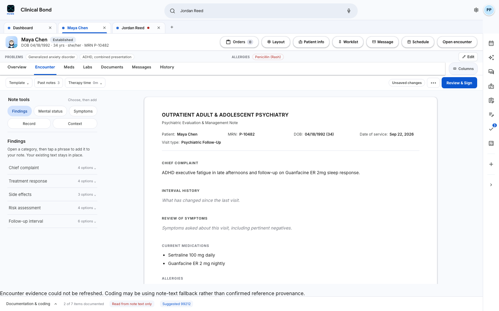

- **What it demonstrates**:
  - **Structured Note Authoring**: Specialized outpatient psychiatric evaluation and management note with Chief Complaint, Interval History, ROS, Current Medications, and Allergies.
  - **Clinical Findings Toolbar**: One-tap clinical chips for Mental Status, Symptoms, Treatment Response, and Risk Assessment.
  - **Focus Mode**: One-click *Focus* button entering distraction-free documentation mode.
  - **Review & Sign Modal**: Explicit human signature gate before finalizing the legal record.

---

### Screenshot 5b: Encounter Visit Readiness Panel (D-100)
**File**: `docs/gemini-context/screenshots/05b_encounter_visit_readiness.png`

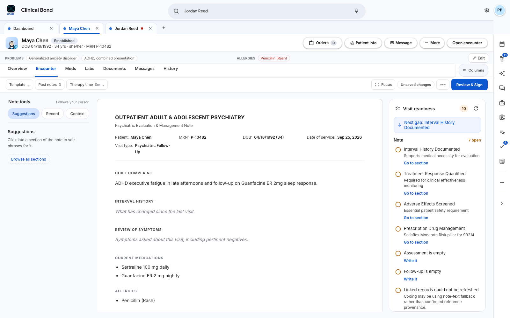

- **What it demonstrates**:
  - Live **Visit Readiness Panel** docked beside the note workspace.
  - Dynamically projects:
    - Real-time coding goals (e.g. *"Interval History Documented: Supports medical necessity for evaluation"*, *"Prescription Drug Management: Satisfies Moderate Risk pillar for 99214"*).
    - Next gap banner guiding documentation flow.
    - One-click *"Go to section"* and *"Write it"* shortcuts that move the cursor directly to the missing section.

---

### Screenshot 6: Document Reader with SHA-256 Provenance
**File**: `docs/gemini-context/screenshots/06_documents_provenance_sha.png`

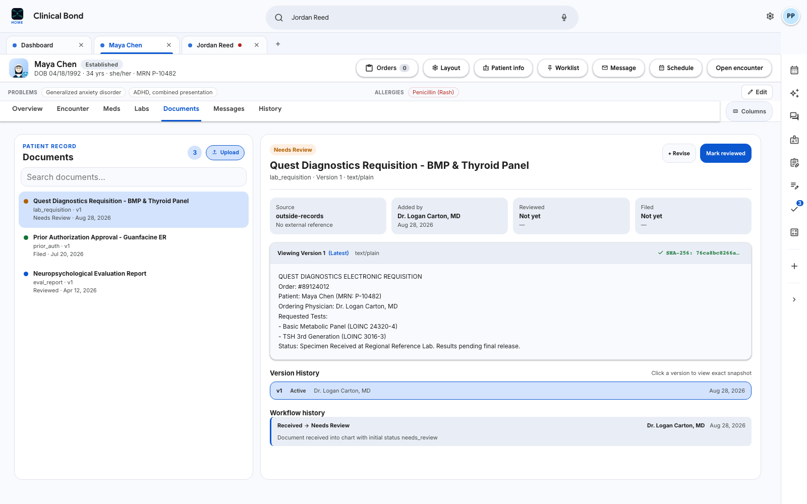

- **What it demonstrates**:
  - Integrated document viewer with direct inspection of external clinical records (Quest Diagnostics Requisitions, Prior Authorization Approvals, Neuropsychological Evaluations).
  - **Cryptographic Provenance**: Every document maintains its original SHA-256 hash badge, upload origin, and version history.

---

### Screenshot 7: Right Companion Rail (Communication Dock)
**File**: `docs/gemini-context/screenshots/07_communication_companion.png`

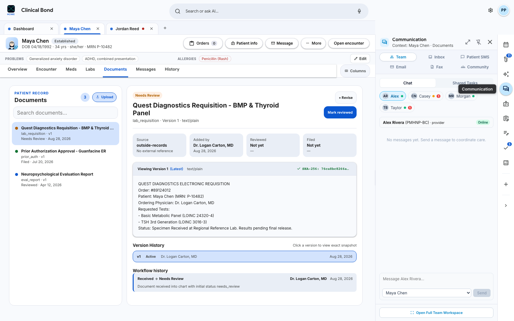

- **What it demonstrates**:
  - **Context-Preserving Multi-Tasking**: The Communication companion docks on the right rail, allowing clinicians to chat with team members or draft patient SMS messages without closing the patient chart.
  - Channels for **Team Chat**, **Inbox**, **Patient SMS**, **Email**, and **e-Fax**.
  - Contextual tagging linking internal conversations directly to the active patient chart (`Context: Maya Chen`).

---

### Screenshot 7b: Rapid Lab Ordering Companion Panel
**File**: `docs/gemini-context/screenshots/07b_labs_ordering_companion.png`

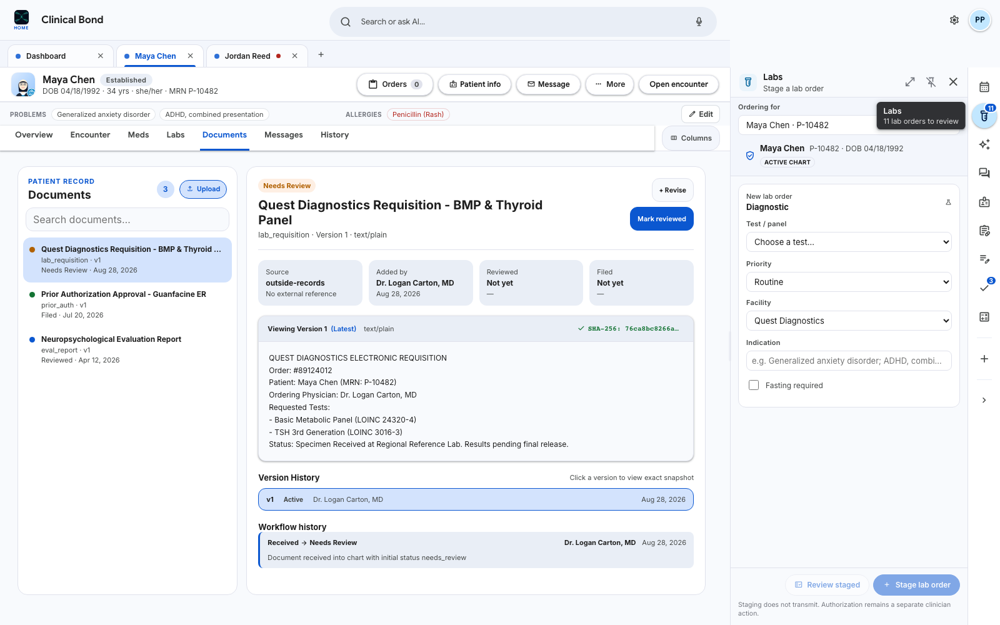

- **What it demonstrates**:
  - Dedicated right-rail companion panel for **Lab Ordering** (`data-tool-id='labs'`).
  - Rapid requisition staging for the active patient (Maya Chen · P-10482): Fasting Lipid Panel & HbA1c (LOINC 24331-1 / 4548-4) for atypical antipsychotic metabolic monitoring.
  - Protocol surveillance priority selection, Quest Diagnostics routing, and fasting instructions.
  - Explicit clinical safety notice: *"Staging does not transmit. Authorization remains a separate clinician action."*

---

### Screenshot 7c: Clinical Calculators & ASRS v1.1 Adult ADHD Assessment
**File**: `docs/gemini-context/screenshots/07c_asrs_adhd_assessment_tool.png`

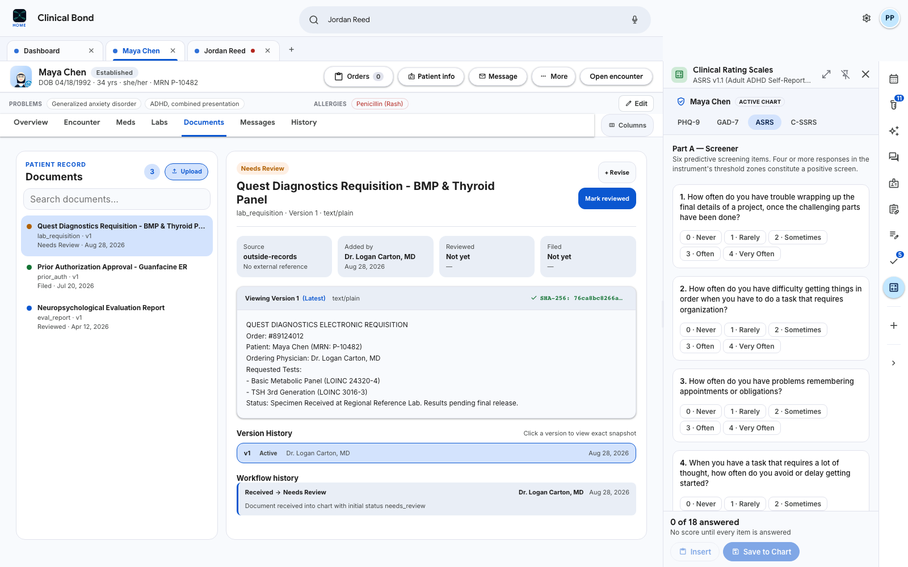

- **What it demonstrates**:
  - Standardized clinical rating instruments in the companion dock: **PHQ-9**, **GAD-7**, **ASRS v1.1**, **C-SSRS**.
  - Shows the **ASRS v1.1 (Adult ADHD Self-Report Scale Symptom Checklist)**.
  - Real-time scoring calculation (0 to 72), Part A shaded-box threshold analysis (4+ items in threshold = positive screen), with single-click buttons to *"Insert into Note"* or *"Save to Chart"*.

---

### Screenshot 8: Configurable Clinical Monitoring Settings Modal (D-099)
**File**: `docs/gemini-context/screenshots/08_clinical_monitoring_settings.png`

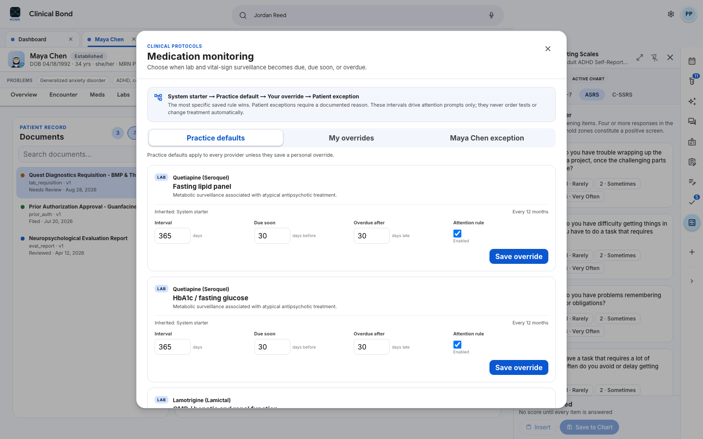

- **What it demonstrates**:
  - Dedicated clinical protocols modal for medication monitoring intervals.
  - 4-Tier governance: *System starter $\rightarrow$ Practice default $\rightarrow$ Provider override $\rightarrow$ Patient exception*.
  - Protocol rules for Quetiapine (Fasting lipid panel every 365 days, HbA1c/glucose) and Lamotrigine (hepatic/renal function).
  - Explicit non-autonomous boundary: alerts inform clinicians; they never order tests or alter regimens automatically.

---

### Screenshot 9: Billing, Fee Schedules & Superbill Workspace (D-101)
**File**: `docs/gemini-context/screenshots/09_billing_superbill_workspace.png`

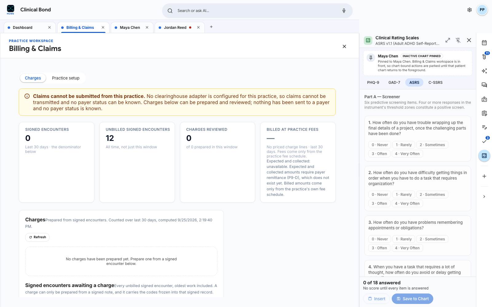

- **What it demonstrates**:
  - Practice Billing & Claims workspace with strict safety banner: *"Claims cannot be submitted from this practice. No clearinghouse adapter is configured... Charges can be prepared and reviewed."*
  - Metrics cards: Signed Encounters, Unbilled Signed Encounters, Charges Reviewed, Billed at Practice Fees ($110.00).
  - Charge table with reviewed charges (Sofia Martinez, Sep 24, 2026, CPT 99212, F33.1).
  - Side panel displaying legal record hash `74be2128ea...` (codes frozen at signature) and audited superbill details.
  - Companion parking indicator: *"Maya Chen INACTIVE CHART PINNED: Billing workspace is in front, so chart-bound actions are parked."*

---

### Screenshot 10: Zen Home Suite Launcher
**File**: `docs/gemini-context/screenshots/10_zen_home_launcher.png`

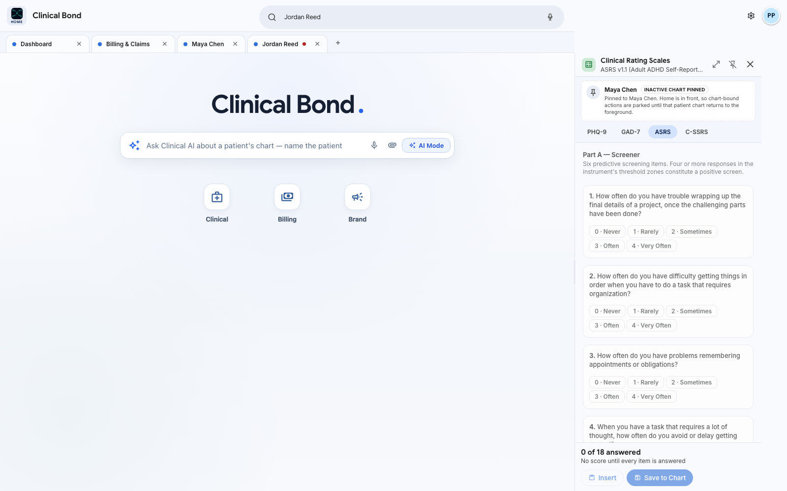

- **What it demonstrates**:
  - **Calming Ambient Aesthetic**: High-resolution scenic backdrop providing an instant visual reset from clinical cognitive overload.
  - **Ambient AI Intent Bar**: Centered natural language prompt ("Ask Clinical AI about a patient's chart — name the patient") with voice input toggle.
  - **Structured Query Chips**: Non-hallucinatory templates ("Open [patient]'s last encounter", "What was [patient]'s last lithium level?", "Draft a CMP for [patient]").
  - **Suite Navigation**: Primary launch tiles for **Clinical**, **Billing**, and **Brand**.

---

### Screenshot 11: Interactive Calendar Workspace
**File**: `docs/gemini-context/screenshots/11_calendar_workspace.png`

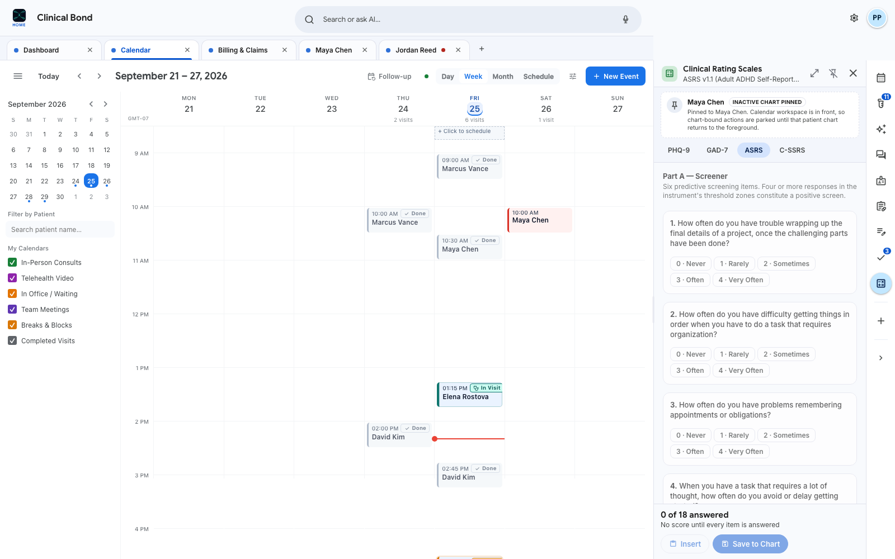

- **What it demonstrates**:
  - Multi-view practice scheduling grid (Day, Week, Month) with time intervals.
  - Color-coded appointment blocks (In-Person Consults, Telehealth Video, In Office / Waiting, Team Meetings, Breaks).
  - Patient search filter and direct visit kickoff from calendar events.

---

### Screenshot 12: Prospective Patient Intake Workspace
**File**: `docs/gemini-context/screenshots/12_intake_workspace.png`

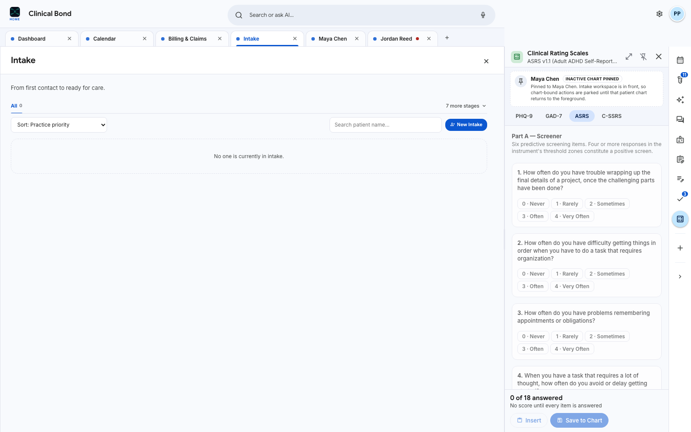

- **What it demonstrates**:
  - Dedicated prospective patient pipeline managing patients from first inquiry to visit-ready.
  - Multi-stage pipeline tracking (Inquiry, Insurance Verification, Clinical Screening, Scheduling).
  - Fast prospect creation with optional immediate appointment booking.

---

### Screenshot 13: AI Omnibox Natural Language Operator
**File**: `docs/gemini-context/screenshots/13_omnibox_ai_intent.png`

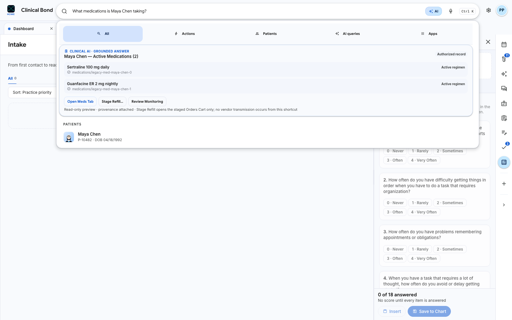

- **What it demonstrates**:
  - Omnibox (`Ctrl K` or Voice) serving as the workspace operator.
  - Natural language parsing ("What medications is Maya Chen taking?").
  - Categorized result routing: **All**, **Actions** (e.g. *Open Maya Chen · Meds*), **Patients**, **AI queries**, and **Apps**.
  - Directly opens the correct patient chart and tab with zero menu navigation.

---

### Screenshot 14: Adaptive Layout Customizer (Elastic Density)
**File**: `docs/gemini-context/screenshots/14_adaptive_layout_customizer.png`

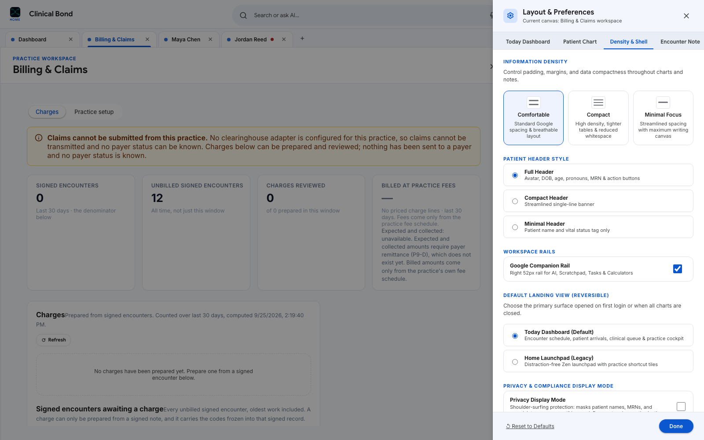

- **What it demonstrates**:
  - **Progressive Disclosure Drawer**: Empowers each clinician to customize their workspace.
  - Tabs: **Today Dashboard**, **Patient Chart**, **Density & Shell**, **Encounter Note**.
  - Modular Window Arrangement: Toggle or reorder AI Morning Briefing, Patient Flow Roster, Daily Metric Cards, Action Queues, Team Collaboration, and Waiting Room.
  - Information Density Switcher: Seamless toggling between **Comfortable**, **Compact**, and **Minimal** modes.

---

## 5. How Gemini Chat Can Help & Key Discussion Topics

When discussing Clinical Bond in Gemini Chat, here are prime areas where Gemini can provide high-value analysis, design feedback, and code suggestions:

1. **Visit Readiness & Decision Support Evolution**:
   - Critiquing the real-time CPT 99214 medical decision-making rule projections.
   - Refining the clinical gap guidance in the note to avoid cognitive distraction during patient dialogue.
2. **Clinical Monitoring & Medication Safety (D-099)**:
   - Expanding protocol definitions for complex psychiatric regimens (e.g. Clozapine absolute neutrophil count tracking, lithium + ACE-inhibitor drug-drug interaction surveillance).
   - Designing safety guardrails for e-prescribing controlled substances (EPCS) and 2FA credential ceremonies.
3. **Billing, Superbill & Clearinghouse Readiness (D-101)**:
   - Reviewing the audited Superbill format for private pay / out-of-network reimbursement compliance.
   - Designing ANSI X12 837P claim generation adapters while preserving our strict vendor isolation boundary.
4. **Cognitive Ergonomics & Progressive Disclosure**:
   - Evaluating the density transitions between the Zen Pad and Cockpit modes.
   - Recommending micro-interactions and keyboard accessibility enhancements across multi-pane split layouts.

---

*Generated for Clinical Bond pair-programming & Gemini Chat analysis.*
